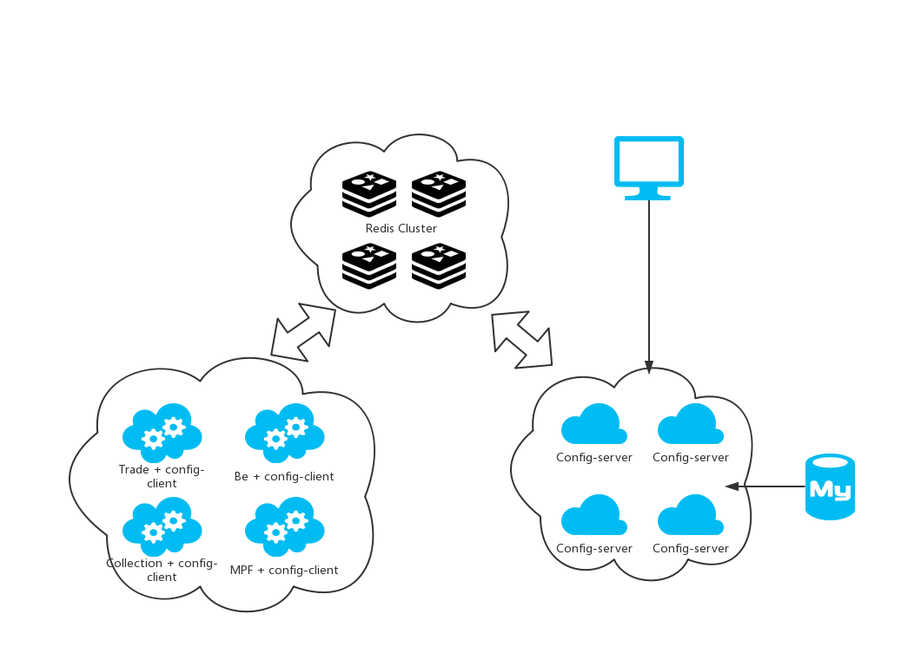
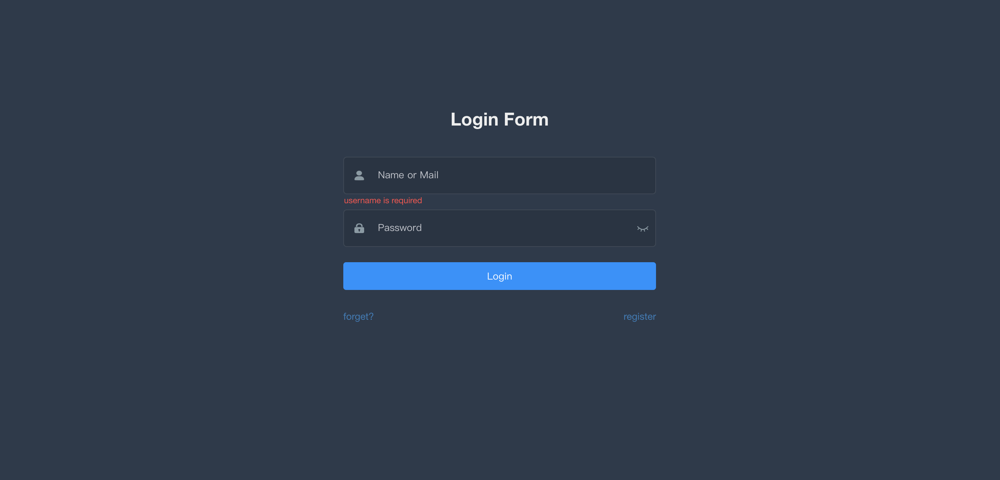
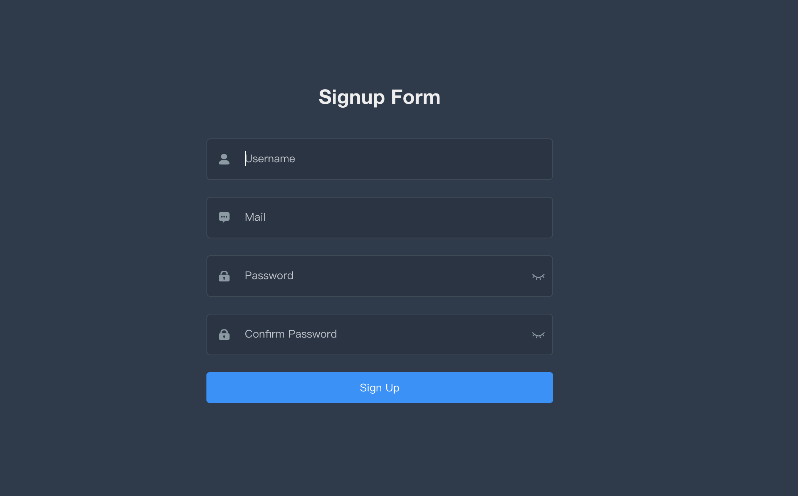
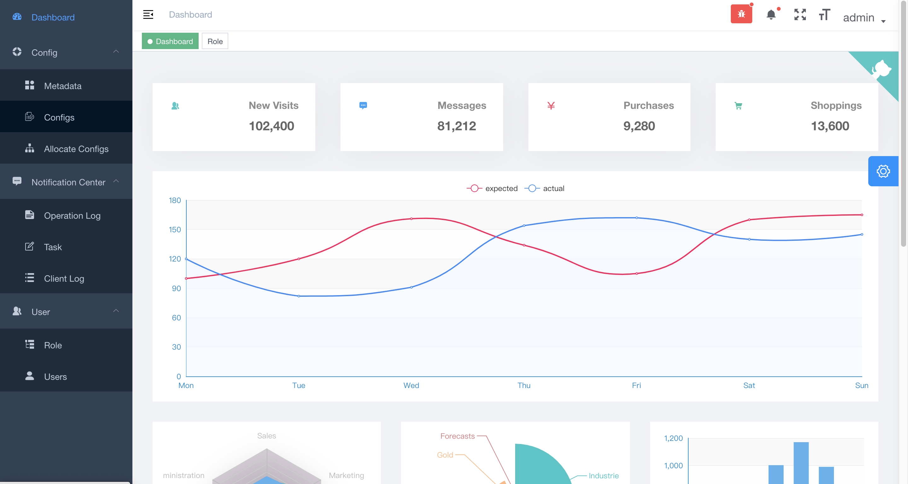
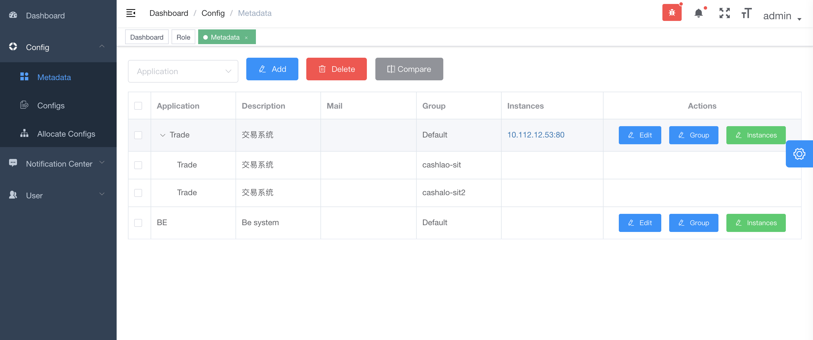
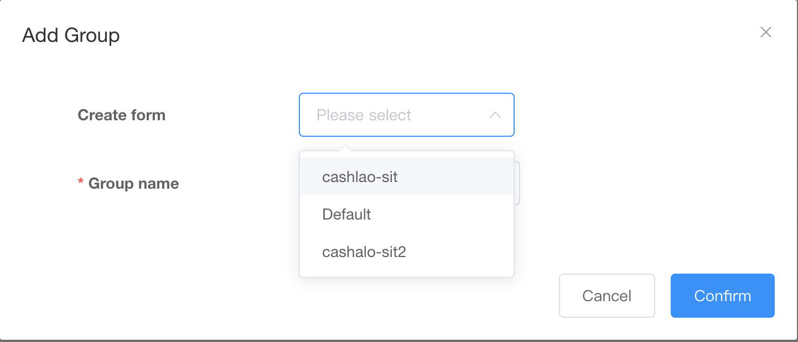
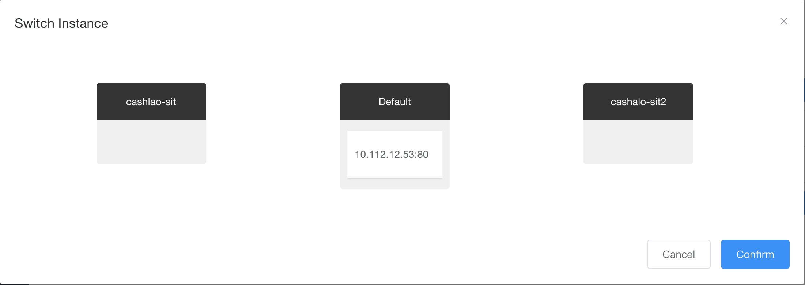
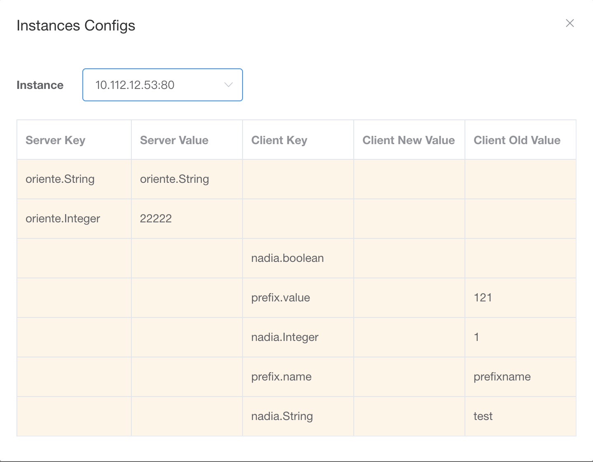
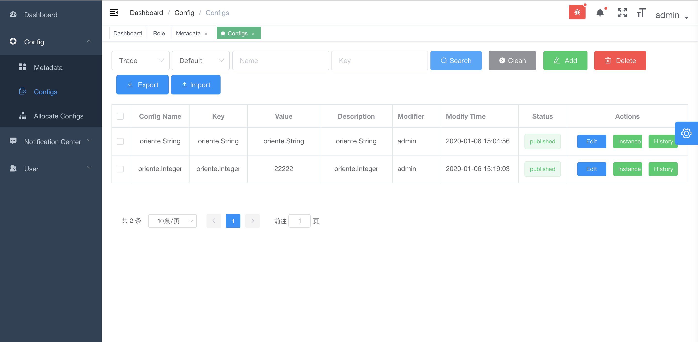

# Nadia Config Center

## 组件介绍
- [nadia-client](nadia-client/README.md)
- [nadia-server](nadia-server/README.md)

## Release-Note
- v1.0

## 主要目标：

- 兼容springboot框架，业务系统无需代码变更
- 快速接入，jar包引用
- 配置动态更新，实时生效
- 支持集群分组，配置差异化
- 提供配置统一变更平台，支持平台用户的权限管理和配置变更的权限管理

#### 部署图

#### 管理平台介绍

1. 登录页面

2. 注册页面

3. 主界面
###### 根据登录用户的角色不同，菜单按钮会有相应变化

4. 配置管理-元数据管理
###### 元数据管理是所有配置的基础，客户端使用配置项时需要指定相关的元数据

###### 名词解释
* Application 系统名称，客户端可以指定使用任意一套系统下的配置。
* Group 组名称，客户端指定系统后，仍需要指定使用系统下的某个组。若不强制指定，客户端启动后会默认使用Default组下的配置，后期可使用组切换功能切换至不同组。

###### 功能说明
* Add 新增Application，同时新增默认Group(Default)。
* Delete 删除Application\Group信息。当前Group如果正在被使用，或当前组为Default组且存在非Default组时，不能删除。Defualt组删除后将同时删除Application。
* Compare 比较同一Application下不同Group的配置差异，可多选，但至少选两个组。

* Edit 修改Application信息
* Group 新增组。可选择从某个组复制所有已发布配置项，或生产新的空组。

* Instances 可将某实例调整至另一组。

* Inscance 查看弄实例当前的配置与服务端配置的差异。

5. 配置管理-配置项管理
###### 配置项管理提供具体配置的增删改查、发布等功能

